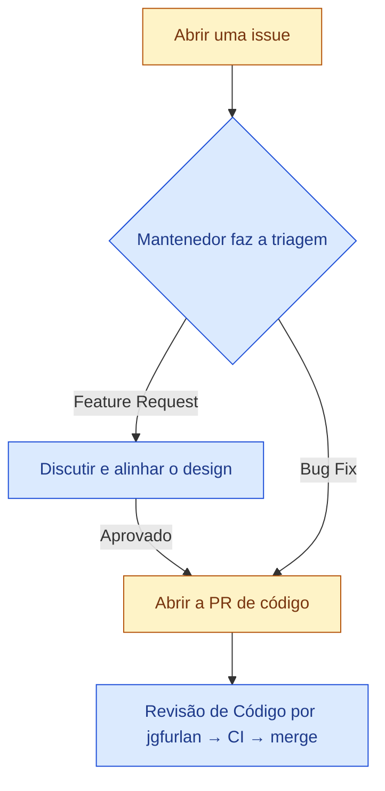

# Contribuindo para o Nexus Wallet

Obrigado por ajudar a melhorar o Nexus Wallet! Este guia explica como abrir issues, propor mudanças e ter seu trabalho revisado.

> [!TIP]
> **Converse conosco no Discord.** Conecte-se com outros contribuidores e o mantenedor (`jgfurlan`) no nosso servidor do Discord — um bom lugar para tirar dúvidas pontuais, discutir o design e fazer pareamento (pairing) enquanto você trabalha em uma issue ou PR. 

## TL;DR (Resumo)

- Correções de bugs (bug fixes) são bem-vindas assim que o relato for acionável através dos detalhes fornecidos ou após a triagem do mantenedor.
- Solicitações de novas funcionalidades (feature requests) devem ser discutidas e alinhadas em uma issue antes que as PRs sejam aceitas.
- PRs de implementação devem incluir comprovação de testes manuais.

## Como funciona a contribuição para o Nexus Wallet

- **As Issues são o ponto de partida para tudo.** Discussão, escopo e design acontecem na issue antes que qualquer PR seja aberta.
- **Novas funcionalidades:** É altamente recomendável abrir uma issue e garantir o alinhamento com `jgfurlan` antes de começar a escrever o código de novas features. Isso economiza o tempo de todos e garante que a funcionalidade se alinhe aos objetivos do projeto.
- **Correções de bugs:** Podem ir direto para uma code PR assim que o relato for reprodutível ou acionável de alguma outra forma.

## Fluxo de Contribuição



## Como abrir uma boa Issue

Pesquise pelas issues existentes antes de abrir uma nova para evitar duplicatas.

### Relatórios de bugs

Um bom relatório de bug inclui:

- Um título claro e um parágrafo resumindo o problema.
- Passos para reproduzir (com um exemplo mínimo, onde possível).
- Comportamento esperado vs. comportamento atual.
- Detalhes relevantes do ambiente (SO, versão do Node, navegador, etc.).
- Logs, capturas de tela ou gravações de tela quando relevante.

### Solicitações de funcionalidades

Uma boa solicitação de funcionalidade descreve o problema pela perspectiva do usuário antes de qualquer proposta de implementação. Inclua:

- A necessidade do usuário ou ponto de dor, e quem a experimenta.
- O comportamento atual e por que ele deixa a desejar.
- Um rascunho do comportamento ou fluxo de trabalho desejado.

## Abrindo uma PR (Pull Request)

1. Crie uma branch a partir da `main` (ou `master`).
2. Implemente a mudança e adicione testes (veja [Testes](#testes)).
3. Execute as verificações locais (`pnpm lint`, `pnpm test`) e corrija quaisquer falhas antes de fazer o push.
4. Abra uma PR e adicione uma descrição clara das mudanças.
5. Mantenha a PR focada em uma única alteração lógica.

Você **não precisa solicitar revisores manualmente**. `jgfurlan` revisará as PRs o mais breve possível.

**Você deve incluir provas de testes manuais**. Para mudanças pequenas, isoladas e visuais, você deve incluir **capturas de tela do antes e do depois**. Para mudanças maiores, você também deve incluir uma **gravação de tela narrada** ou um plano de testes claro na descrição da PR.

## Configuração de Desenvolvimento

O Nexus Wallet é um monorepo que usa o `pnpm`. Início rápido:

```bash
# Instalar dependências
pnpm install

# Rodar os servidores de desenvolvimento locais
pnpm dev

# Rodar lint e testes
pnpm lint
pnpm test
```

## Testes

Os testes são necessários para a maioria das alterações de código:

### Testes Manuais
Os testes manuais são necessários para mudanças que podem ser testadas manualmente. Para mudanças na UI, por favor forneça screenshots ou gravações de tela na sua PR.

### Testes Automatizados
- **Correções de bugs** devem incluir um teste de regressão que detectaria o bug.
- **Lógicas algorítmicas ou complexas** precisam de testes unitários.

Rode os testes com:
```bash
pnpm test
```

## Estilo de Código

- Garanta que o `pnpm lint` passe sem avisos ou erros.
- Siga a formatação existente e as convenções usadas na base de código (ex: Prettier, ESLint).

## Convenções de Commits e Branches

- Nomes de branch devem ser descritivos (ex: `feature/nova-ui`, `fix/bug-login`).
- As mensagens de commit devem explicar *o que* e o *porquê*, e não apenas *o que*. Considere usar o padrão [Conventional Commits](https://www.conventionalcommits.org/pt-br/v1.0.0/).

## Pedindo Ajuda

- Converse com `jgfurlan` e a comunidade no Discord.
- Abra uma issue no GitHub para bugs ou pedidos de funcionalidades.
