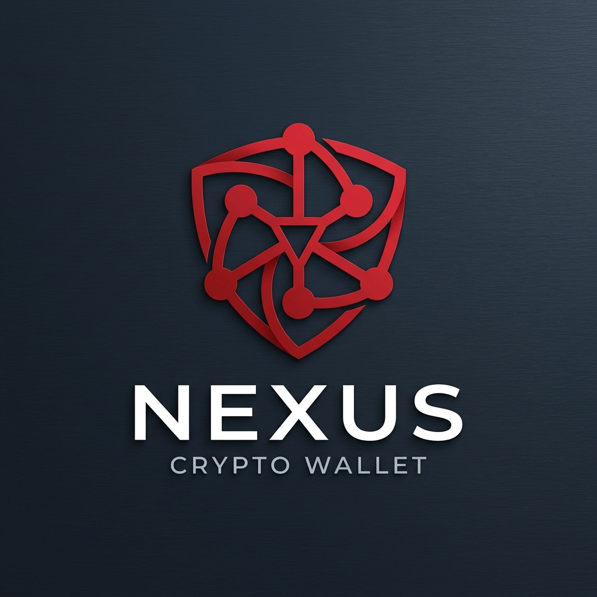
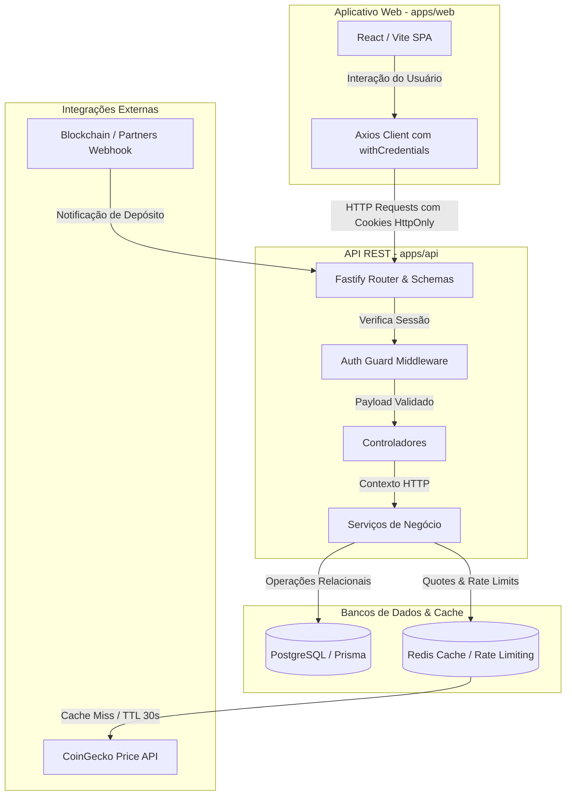
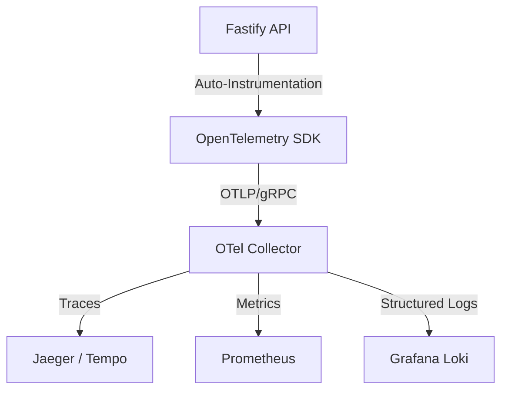

<div align="center">
  
  
  # 🌌 Nexus Wallet
  
  **Uma carteira digital Sandbox premium, segura e resiliente para transações fiat e cripto.**
  
  [](https://www.typescriptlang.org/)
  [](https://react.dev/)
  [](https://fastify.dev/)
  [](https://www.prisma.io/)
  [](https://redis.io/)
  [](https://www.docker.com/)

</div>

---

## 📖 Visão Geral

O **Nexus Wallet** é uma plataforma sandbox de carteira digital projetada sob o paradigma de *Spec-Driven Development* e focada em robustez transacional absoluta. O sistema gerencia saldos fiduciários (BRL) e criptoativos (BTC, ETH), fornecendo fluxos completos de depósito (faucet), saques idempotentes e conversões (swaps) dinâmicas alimentadas por cotações em tempo real.

---

## 🏛️ Arquitetura do Sistema

O Nexus Wallet é estruturado como um monorepo eficiente utilizando **pnpm workspaces** para isolar as responsabilidades do Frontend e do Backend, suportado por bancos de dados relacionais e cache em memória:



Para mais detalhes sobre os fluxos internos de autenticação segura e concorrência transacional, consulte as **[Diretrizes de Arquitetura](./docs/guidelines/architecture.md)**.

---

## 🛠️ Recursos & Funcionalidades

| Módulo | Descrição | Status |
| :--- | :--- | :---: |
| 🔑 **Autenticação Avançada** | Login e registro de usuários com JWT de acesso (15 min) e rotação rígida de refresh tokens (7 dias). | `Pronto` |
| 💰 **Saldos Multiativos** | Gerenciamento de carteira com suporte nativo a Real (BRL), Bitcoin (BTC) e Ethereum (ETH). | `Pronto` |
| 🔄 **Conversões Instantâneas** | Swap cotado em tempo real com taxa fixa de 1.5% e tempo de expiração de 30 segundos (via Redis). | `Pronto` |
| 📥 **Simulador de Faucet** | Injeção sandbox de saldo fiduciário ou cripto para fins de testes. | `Pronto` |
| 📤 **Saques Idempotentes** | Retiradas com chave PIX ou endereço blockchain validados e chave de idempotência de transação única. | `Pronto` |
| 🌓 **Temas Dinâmicos** | Interface adaptável com suporte completo aos modos Claro e Escuro (Carmim & Rosé Pine). | `Pronto` |

---

## 🛡️ Pilares de Consistência e Resiliência

A integridade do Nexus Wallet baseia-se em conceitos avançados de engenharia de software transacional. Detalhes completos e análises de impacto podem ser consultados no **[Blueprint de Evolução Arquitetural](./docs/architecture/evolution-blueprint.md)**.

| Pilar | Descrição Técnica | Implementação no Nexus |
| :--- | :--- | :--- |
| **Partidas Dobradas (Ledger)** | Nenhum saldo é alterado sem uma contrapartida. Cada movimentação gera um débito e um crédito correspondentes e imutáveis. | Tabela `LedgerEntry` vinculada a `Transaction` e `WalletBalance`. |
| **Concorrência Serializable** | Transações financeiras concorrentes são executadas de forma isolada, evitando condições de corrida (*race conditions*). | `Prisma.TransactionIsolationLevel.Serializable` nas rotas de Swap e Saque. |
| **Transactional Outbox** | O envio de notificações assíncronas (como callbacks de depósitos) é persistido localmente na transação de banco de dados. | Registro do estado de callback e fila de webhooks persistente em banco de dados. |
| **Caching com Redis** | Cotações externas de mercado são mantidas em cache com TTL curto para evitar gargalos na API. | Armazenamento de quotes no Redis com expiração forçada de 30 segundos. |
| **Token Bucket Rate Limiting** | Controle de tráfego de requisições de API usando algoritmo distribuído no Redis. | Proteção ativa contra abuso de endpoints financeiros por IP e usuário. |

---

## 🚀 Roadmap de Evolução: OpenTelemetry

Para escalar e manter a alta disponibilidade em produção, a próxima fase evolutiva do Nexus Wallet contempla a implementação de **Observabilidade Distribuída** utilizando a stack de padrões abertos do **OpenTelemetry (OTel)**:



1. **Rastreamento Distribuído (Distributed Tracing):**
   * Instrumentação automática do Fastify (`@opentelemetry/instrumentation-fastify`) e do cliente HTTP (`@opentelemetry/instrumentation-http`).
   * Rastreamento ponta a ponta de fluxos de transação de ponta (ex: do clique de Swap no frontend até as inserções no banco através do Prisma).
2. **Coleta de Métricas (Metrics):**
   * Monitoramento de latência média de requisições financeiras, taxa de acerto do cache do Redis, e saturação do banco de dados PostgreSQL.
   * Instrumentação manual usando métricas personalizadas (Counter, UpDownCounter e Histogram) para contar transações bem-sucedidas vs falhas de saldo.
3. **Correlação de Logs com Contexto (Structured Logging):**
   * Integração do SDK do OpenTelemetry com o logger `Pino` para injetar automaticamente `traceId` e `spanId` nos logs estruturados.
   * Capacidade de filtrar todos os logs gerados em segundo plano relacionados a uma requisição específica usando o ID único do trace.

---

## ⚙️ Inicialização Rápida

### Requisitos Mínimos
* Node.js v20+ e gerenciador de pacotes **pnpm** (v9+)
* Docker e Docker Compose instalados

### Como Executar

1. **Subir os Bancos de Dados (Postgres & Redis):**
   ```bash
   # A partir do diretório raiz
   wsl docker start nexus_wallet_db nexus_wallet_redis
   # Ou suba a infraestrutura via docker compose no diretório apps/api:
   # cd apps/api && docker-compose up -d
   ```

2. **Roda as Migrações do Banco de Dados:**
   ```bash
   npx pnpm --filter api db:migrate
   ```

3. **Executar a Aplicação em Modo de Desenvolvimento:**
   ```bash
   npx pnpm dev
   ```
   * O frontend web estará acessível em: `http://localhost:5173`
   * A documentação interativa do Swagger estará em: `http://localhost:3000/docs`

4. **Rodar a Suíte Completa de Testes:**
   ```bash
   npx pnpm test
   ```
