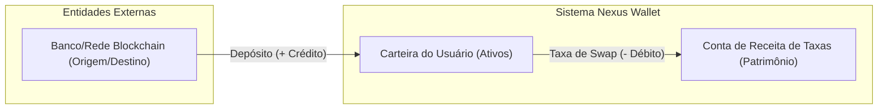

# Blueprint de Evolução Arquitetural e Resiliência

**Documento de Arquitetura e Engenharia de Produção**  
**Issue Referenciada:** GH84 — [DOCS] Deliver Professional Architectural Evolution and Resiliency Report  
**Autor:** Engenheiro de Software Principal / Arquiteto de Soluções  
**Idioma:** Português (PT-BR)  

---

## Introdução

Este blueprint técnico descreve os pilares de resiliência, consistência transacional e escalabilidade necessários para elevar o **Nexus Wallet** ao nível de uma plataforma financeira de nível de produção (*production-grade*). Ele aborda as soluções para os desafios mais críticos em sistemas de movimentação de dinheiro (*ledgering*), concorrência distribuída, entrega garantida de eventos, estratégias de cache resilientes e mitigação de abuso/DDoS através de limitadores de taxa.

---

## 1. Ledger de Contabilidade (Double-Entry & Auditing)

O motor financeiro de uma carteira de criptoativos e moeda fiduciária exige consistência matemática absoluta. Registros simples de "saldo atual" são suscetíveis a corrupções silenciosas de dados, falhas de sincronização e auditorias impossíveis.

### Design de Partidas Dobradas (Double-Entry Bookkeeping)
Para cada transação financeira na plataforma (Depósito, Saque ou Conversão), o sistema não deve apenas modificar uma coluna de saldo, mas sim registrar entradas de débito e crédito imutáveis ligadas a contas de controle internas e externas.



#### Regras de Ouro do Ledger:
1. **Invariante de Equilíbrio (Soma Zero):** A soma de todas as movimentações financeiras (`deltas`) geradas em uma transação deve ser exatamente zero.
   $$\sum \text{Créditos} + \sum \text{Débitos} = 0$$
2. **Imutabilidade Absoluta:** Uma entrada no ledger nunca é modificada ou excluída. Erros são corrigidos com transações de estorno/compensação novas.

### Cadeia de Blocos do Ledger (Hash Chaining)
Para evitar adulterações internas no banco de dados por administradores ou atacantes, implementa-se um encadeamento criptográfico das entradas do ledger:

```
┌─────────────────────────┐     ┌─────────────────────────┐     ┌─────────────────────────┐
│ Ledger Entry #1         │     │ Ledger Entry #2         │     │ Ledger Entry #3         │
├─────────────────────────┤     ├─────────────────────────┤     ├─────────────────────────┤
│ Transaction: Deposit    │     │ Transaction: Swap       │     │ Transaction: Withdraw   │
│ Amount: +1000 BRL       │     │ Amount: -500 BRL        │     │ Amount: -100 BRL        │
│ PrevHash: 0000000000000 │◄────┼─PrevHash: Hash(Entry #1)│◄────┼─PrevHash: Hash(Entry #2)│
│ CurrentHash: 9e3a8f...  │     │ CurrentHash: a7c1b8...  │     │ CurrentHash: 3f9d4c...  │
└─────────────────────────┘     └─────────────────────────┘     └─────────────────────────┘
```

Onde:
$$\text{CurrentHash}_n = \text{SHA256}(\text{Data}_n \parallel \text{CurrentHash}_{n-1})$$

### Jobs de Auditoria Periódica (Reconciliation Jobs)
Um worker em background executa tarefas de reconciliação de hora em hora:
- **Auditoria de Hash:** Percorre a cadeia recalculando os hashes e garantindo que o `PrevHash` confira. Qualquer quebra na integridade gera alertas vermelhos de segurança.
- **Auditoria de Balanço:** Soma todos os deltas históricos do banco para cada usuário e valida se:
  $$\text{Saldo Atual da Tabela Balances} = \sum \text{Deltas do Ledger}$$

---

## 2. Concorrência Transacional e Isolamento Serializable

Sistemas de carteira sofrem de concorrência intensa. Se um usuário com $100$ BRL tentar realizar dois saques de $100$ BRL exatamente ao mesmo tempo, um sistema sem controle adequado de concorrência pode permitir o saque duplo (*Double Spending*), deixando a plataforma com saldo negativo.

### Transações Serializable vs SELECT FOR UPDATE

#### Abordagem A: Isolamento Serializable (Recomendado para Alta Integridade)
O nível de isolamento `SERIALIZABLE` é o mais estrito do padrão SQL. Ele garante que a execução concorrente de transações resulte no mesmo estado que se tivessem sido executadas uma após a outra de forma sequencial.

```typescript
// Exemplo de Transação com Prisma
await prisma.$transaction(async (tx) => {
  // 1. Consulta saldo atual
  // 2. Valida se o saldo é suficiente
  // 3. Deduz o saldo
  // 4. Cria transação e ledger
}, {
  isolationLevel: Prisma.TransactionIsolationLevel.Serializable
});
```

*Tradeoffs:* O banco de dados abortará transações concorrentes que tentem ler ou escrever na mesma linha de dados simultaneamente para evitar anomalias de leitura/escrita. A API do Nexus Wallet deve tratar o erro `P2034` (falha de serialização no Postgres) e implementar uma estratégia de **Retry com Backoff Exponencial**.

#### Abordagem B: Bloqueio Pessimista (`SELECT FOR UPDATE`)
Bloqueia as linhas consultadas até que a transação atual seja confirmada ou revertida. Impede que qualquer outra conexão altere ou leia a linha com a intenção de atualização.
*Tradeoffs:* Reduz falhas de aborto de transação comparado ao `SERIALIZABLE`, mas aumenta o tempo de espera de requisições, podendo levar a cenários de *deadlock* sob alta carga se a ordem dos bloqueios não for rigorosamente controlada.

---

## 3. Entrega Confiável de Mensagens (Transactional Outbox Pattern)

Quando uma transação financeira ocorre, precisamos notificar parceiros externos (gateways de pagamento, serviços de compliance, e-mail/push ou webhooks de terceiros).

### O Problema da Dupla Escrita (Dual-Write Problem)
Executar uma alteração no banco de dados e, em seguida, fazer uma requisição HTTP externa dentro do mesmo escopo de código é falho:
- Se a chamada de rede falhar, mas o banco já tiver comitado, a transação ocorre mas o parceiro nunca fica sabendo (perda de mensagens).
- Se a rede responder com sucesso, mas o banco falhar ao comitar (por concorrência ou queda do servidor), notificaremos o usuário de uma transação que, no final das contas, foi desfeita (falso positivo de depósito/saque).

### Arquitetura do Transactional Outbox
Para resolver esse problema, introduzimos uma tabela de `outbox_events` no mesmo banco de dados relacional.

```
┌────────────────────────────────────────────────────────┐
│              Escopo da Transação Atômica               │
│                                                        │
│ ┌──────────────────────┐    ┌────────────────────────┐ │
│ │  Cria Ledger/Transação│ ──►│ Insere Evento PENDING  │ │
│ │  (Tabela Ledger)     │    │ (Tabela OutboxEvents)  │ │
│ └──────────────────────┘    └────────────────────────┘ │
└───────────────────────────┬────────────────────────────┘
                            │ (Commit Atômico)
                            ▼
                  ┌───────────────────┐
                  │ Banco de Dados DB │
                  └─────────┬─────────┘
                            │ (Polling / CDC)
                            ▼
                 ┌─────────────────────┐
                 │ Outbox Worker       │
                 └──────────┬──────────┘
                            │ (Garante Entrega Atleast-Once)
                            ▼
                ┌───────────────────────┐
                │ Endpoint Webhook/Queue│
                └───────────────────────┘
```

#### Funcionamento:
1. **Escrita Atômica:** Em uma única transação de banco de dados, salvamos a movimentação financeira e inserimos o evento na tabela `outbox_events` com o status `PENDING`.
2. **Worker Desacoplado:** Um processo em background (worker) lê a tabela `outbox_events` periodicamente (ou via logs de replicação com Change Data Capture - CDC).
3. **Envio Garantido (At-Least-Once):** O worker dispara a requisição externa. Se falhar, ele tenta novamente usando políticas de *retry*. Se atingir o limite de tentativas, move o evento para uma fila de falhas (Dead Letter Queue - DLQ).
4. **Confirmação:** Apenas após a resposta de sucesso da rede externa, o status na tabela é atualizado para `DELIVERED`.

---

## 4. Estratégia de Cache e Resiliência (Redis)

O caching melhora drástica e positivamente o tempo de resposta do Nexus Wallet, mas o uso inadequado em sistemas financeiros pode induzir a perdas de dinheiro se saldos obsoletos forem lidos.

### Regra Fundamental de Segurança
> [!IMPORTANT]
> **NUNCA ler dados de saldo a partir do Cache para autorizar movimentações de saída de dinheiro (Saque e Swap).**
> Toda lógica de validação de saldo no momento do débito deve obrigatoriamente consultar o banco de dados principal sob isolamento transacional estrito. O cache de saldo serve unicamente para fins informativos e de leitura na UI.

### Padrão de Cache (Cache-Aside Pattern)
Para leitura de cotações de taxas de câmbio (obtidas por exemplo do CoinGecko) e perfis estáticos:

```
                                  [ Requisição de Cotação ]
                                              │
                                              ▼
                                    ┌───────────────────┐
                                    │ Existe no Redis?  │
                                    └─────────┬─────────┘
                                   Sim        │ Não
                     ┌────────────────────────┘         └────────────────────────┐
                     ▼                                                           ▼
         [ Retorna Cotação do Cache ]                                 [ Busca na API Externa ]
                                                                                 │
                                                                                 ▼
                                                                     [ Salva no Redis c/ TTL ]
                                                                                 │
                                                                                 ▼
                                                                        [ Retorna ao Usuário ]
```

- **Políticas de TTL (Time-To-Live):** Cotações expiram em 30 segundos para evitar defasagem financeira em swaps.
- **Invalidação Proativa:** Eventos de alteração de dados limpam as chaves específicas do cache de imediato no Redis (ex: após transação concluída com sucesso, o cache de saldo do usuário é deletado para que a próxima leitura na Dashboard venha direto do banco atualizado).

---

## 5. Limitador de Taxa robusto (Token Bucket com Redis)

O Faucet de depósito de testes e as tentativas de login/saque são vetores de abuso que podem saturar a API ou esgotar saldos da sandbox. Para conter abusos, implementamos o algoritmo **Token Bucket**.

### Algoritmo Token Bucket
Cada usuário (ou IP) possui um "balde" que armazena tokens. Cada requisição consome um token. Se o balde estiver vazio, a requisição é rejeitada com o status `429 Too Many Requests`. Os tokens são regenerados a uma taxa constante ao longo do tempo.

```
       [ Gotejamento Constante (Refill Rate) ]
                      │
                      ▼
             ┌─────────────────┐
             │  \  o   o   o  / │ ◄── Bucket com Capacidade Máxima (ex: 10 tokens)
             │   \  o   o  o /  │
             │    \   o   o /   │
             └──────┬────┬──────┘
             Consome│    │Rejeita (429) se Balde Vazio
                    ▼    ▼
          [ Processa Requisição ]
```

### Implementação Atômica com Redis e Lua Script
Para evitar condições de corrida em ambientes clusterizados de API (onde múltiplas requisições batem ao mesmo tempo e podem ler um valor desatualizado do bucket), a lógica de validação e decremento de tokens deve rodar de forma atômica no Redis. 

Utiliza-se um script Lua avaliado pelo Redis em uma única thread operacional:

```lua
local key = KEYS[1]
local capacity = tonumber(ARGV[1])
local refill_rate = tonumber(ARGV[2])
local refill_period = tonumber(ARGV[3])
local now = tonumber(ARGV[4])

local bucket = redis.call('hgetall', key)
local last_update = now
local tokens = capacity

if #bucket > 0 then
    for i = 1, #bucket, 2 do
        if bucket[i] == 'last_update' then
            last_update = tonumber(bucket[i+1])
        elseif bucket[i] == 'tokens' then
            tokens = tonumber(bucket[i+1])
        end
    end
    -- Calcular tokens adicionados pelo tempo decorrido
    local elapsed = now - last_update
    local generated = math.floor(elapsed * (refill_rate / refill_period))
    tokens = math.min(capacity, tokens + generated)
else
    -- Primeiro acesso
    redis.call('hset', key, 'created_at', now)
end

if tokens >= 1 then
    tokens = tokens - 1
    redis.call('hset', key, 'tokens', tokens, 'last_update', now)
    return 1 -- Permitido
else
    return 0 -- Bloqueado (429)
end
```

### Parametrização Recomendada

| Endpoint | Capacidade Máxima | Taxa de Recarga | Descrição |
|----------|-------------------|-----------------|-----------|
| `POST /auth/login` | 5 tokens | 1 token a cada 5 min | Proteção contra força bruta |
| `POST /test/faucet` | 3 tokens | 1 token a cada 1 hora | Evita saturação do faucet de sandbox |
| `POST /wallet/withdraw` | 10 tokens | 1 token a cada 1 min | Proteção contra spam de requisições de saques |

---

## Conclusão

A implementação destas especificações de arquitetura garantirá que a plataforma Nexus Wallet evolua de forma estruturada, oferecendo resiliência e blindagem de segurança para operações de movimentação financeira. Os padrões aqui propostos formam o alicerce fundamental para a resiliência estrutural e integridade transacional de dados do ecossistema.
