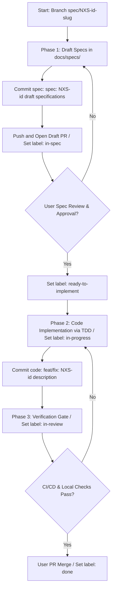

# AI Workflow Rules: Execution Governance

## Core Mandate
One task. One module boundary. One spec. No multi-tasking.

---

## Methodology: Spec-Driven Development

Every change that touches a module boundary, DB schema, API contract, or business logic requires a formal spec **before any code is written**.

### When a Spec is Required vs. Not

| Requires Spec | Does NOT Require Spec |
|---------------|-----------------------|
| New API endpoint | Typo / comment fix |
| Schema migration | Formatting change |
| New module or service | Dependency version bump |
| Business logic change | Log message wording |
| Auth or security change | Test description rename |

### Spec Location
```
docs/specs/NXS-<id>-<slug>/
├── product.md   ← user-facing behavior, invariants, edge cases
└── tech.md      ← implementation plan, modules touched, verification method
```

### The Two-File Contract
- **`product.md`** defines *what* the system does. No implementation details. Written as testable invariants.
- **`tech.md`** defines *how* to build it. References actual file paths. Contains the implementation checklist the agent follows line by line.

Once both files are approved, the agent implements exactly what is written — no improvisation.

---

## Spec Lifecycle & Git Flow Rules

The development lifecycle consists of strictly decoupled sequential phases. **Never write implementation code in the same step or commit as drafting specifications.**



### Phase 1: Specification (`in-spec`)
1. Create a new branch: `spec/NXS-<id>-<slug>`.
2. Write only the spec files (`product.md` and `tech.md`) in `docs/specs/NXS-<id>-<slug>/`. **No production or test files should be created or modified in this phase.**
3. Commit specs: `spec: [NXS-<id>] create specifications for <feature>`.
4. Push the branch and open a Draft Pull Request (or request review).
5. Move the issue/PR label on GitHub to `in-spec`.
6. **GATE 1 (Human Verification):** Present the spec to the user in planning mode. **Stop calling tools and wait for explicit approval.**

### Phase 2: Spec Approval (`ready-to-implement`)
1. Once the user reviews and explicitly approves the specs, the issue/PR label on GitHub is transitioned to `ready-to-implement`.
2. **DO NOT write any production or test code until the issue/PR is explicitly marked as `ready-to-implement` by the user.**

### Phase 3: Code Implementation (`in-progress`)
1. Transition the issue/PR label on GitHub to `in-progress`.
2. Implement the feature following **Test-Driven Development (TDD)** (write failing test -> watch it fail -> write minimal code to pass -> watch it pass -> refactor).
3. Commit implementation: `<type>: [NXS-<id>] <imperative description>` (e.g., `feat: [NXS-4] implement audit endpoint`).

### Phase 4: Verification & Review (`in-review`)
1. Transition the issue/PR label on GitHub to `in-review`.
2. Run the Verification Gate locally: `pnpm test && pnpm lint && pnpm typecheck`.
3. Update `progress-tracker.md` to show the feature is `⏳ In Review` on its branch.
4. Push commits and mark the PR as ready for review on GitHub.
5. **DO NOT MERGE THE PR** until all local and remote CI/CD checks are 100% green.

### Phase 5: Complete (`done`)
1. Once approved and checks are green, squash merge the PR into `main` and delete the feature branch.
2. Update `progress-tracker.md` on `main` to mark the feature as `✅ Done`.
3. Transition the issue/PR label on GitHub to `done`.

---

## Session Governance

### Starting a Session
1. Read `docs/guidelines/progress-tracker.md` — identify the active task.
2. Run `graphify query "active implementation"` to restore context.
3. Read the spec in `docs/specs/NXS-<id>/` for the active task.
4. Do not touch any file outside the spec's **Modules Touched** list.

### Ending a Session
1. Run the verification gate: `pnpm test && pnpm lint && pnpm typecheck`.
2. Update `progress-tracker.md` with current status.
3. Run `graphify update .`.
4. Commit with proper message format.

---

## GitHub Issue & PR Workflow

GitHub Issues = source of truth for **project state & requirements**.
GitHub PRs = source of truth for **code**.

### Branch Naming Convention
Every issue must be resolved in a branch prefixed with `spec/`:
`spec/NXS-<id>-<slug>` (e.g., `spec/NXS-2-auth-jwt`)

### GitHub Labels & Issue State Machine
We use GitHub Labels to track issue/PR state:
- **`in-spec`**: Product and tech specs are being drafted in `docs/specs/NXS-<id>-<slug>/`.
- **`ready-to-implement`**: Specs are approved by the user, ready for coding.
- **`in-progress`**: Code and tests are being written.
- **`in-review`**: Code complete, PR opened, waiting for verification.
- **`done`**: PR merged and verified.

> [!IMPORTANT]
> **VERIFICATION GATE REQUIREMENT:**
> Do NOT merge any pull request until the code is fully implemented, verified locally (via lint, typecheck, and tests), and has successfully passed all automated GitHub Actions CI/CD checks.

**Commit format:** `<type>: [NXS-<id>] <imperative description>`

```bash
# Examples
feat: [NXS-3] implement JWT refresh token rotation
fix: [NXS-7] prevent duplicate deposit via idempotency key
test: [NXS-5] add ledger audit invariant tests
```

---

## Prohibited Actions

| Prohibited | Why |
|------------|-----|
| Fixing unrelated bugs during a feature branch | Causes spec drift; creates untraceable changes |
| Using `pass`, empty catch, or swallowing errors | Silent failures corrupt ledger state |
| Using `number` for monetary values | Floating-point errors in financial math |
| Hardcoding secrets or API keys | Security invariant |
| Touching generated Prisma client directly | Use the `prisma` singleton in `lib/prisma.ts` |
| Calling CoinGecko directly from a module | Must go through `lib/coingecko.ts` (Delegator pattern) |
