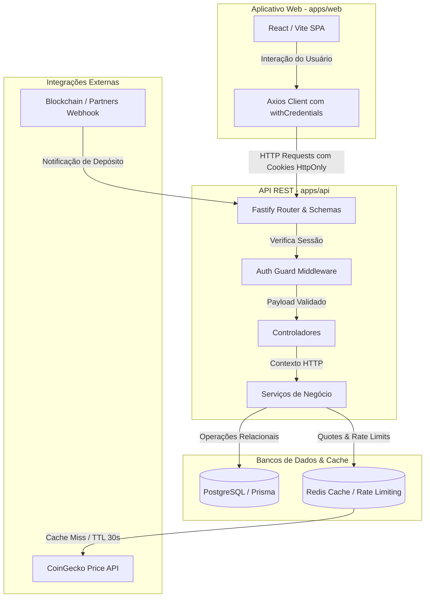
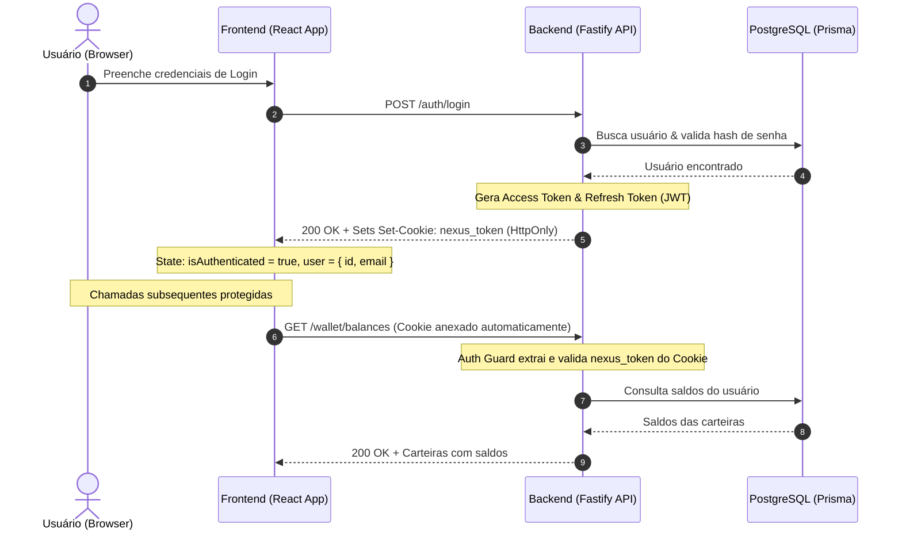
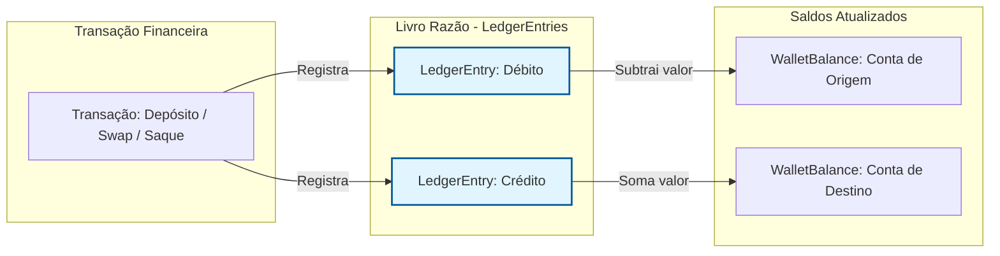

# NexusWallet — Documentação de Arquitetura

Esta página consolida as diretrizes técnicas e as decisões arquiteturais fundamentais tomadas durante o desenvolvimento do NexusWallet (Fase 1).

---

## 1. Topologia do Sistema
O NexusWallet é um monorepo gerenciado com **pnpm workspaces**.
- **Backend (`apps/api`)**: API REST focada em altíssima performance estruturada de forma modular. Desenvolvida utilizando **Fastify** para lidar com altas cargas de RPS (Requests Per Second) e cold-starts eficientes.
- **Frontend (`apps/web`)**: Single Page Application reativa, escrita com **React** e gerenciada pelo **Vite**.

### Diagrama de Topologia do Sistema

---

## 2. Padrões de Projeto do Backend

### Arquitetura Modular (Controller-Service-Router)
Adotamos uma organização vertical baseada em "Features/Módulos" dentro de `src/modules/`. Em vez de separar por camada global (todas as rotas numa pasta, todos os controllers em outra), cada funcionalidade engloba tudo o que lhe pertence:
- **`*.schemas.ts`**: Validações de payload e resposta (usando **Zod** e gerando `$ref` para o Swagger com `fastify-zod`).
- **`*.routes.ts`**: Declaração das rotas do Fastify com seus devidos interceptores e documentação embutida.
- **`*.controller.ts`**: Camada de entrada. Valida as requisições e envia para o serviço. Lida exclusivamente com objetos HTTP.
- **`*.service.ts`**: Onde as regras de negócios residem. Independente do contexto HTTP, comunicando-se ativamente com o Banco de Dados.

### Fluxo de Autenticação (JWT & Cookies HttpOnly)
A autenticação do Nexus Wallet migrou de tokens puramente clientside no `localStorage` para tokens armazenados de forma segura em cookies **HttpOnly, Secure e SameSite=Lax**.

### Matemática Monetária Segura
**Decisão Histórica (GH1):** Todas as transações financeiras, persistências e cálculos de saldo utilizam a biblioteca **`decimal.js`**. O uso nativo do tipo `number` (ponto flutuante) ou `BigInt` (sem decimais) foi vetado devido aos riscos severos de arredondamento em moedas criptográficas (e.g. BTC) e decimais de cotação.

---

## 3. Padrões de Banco de Dados

### ORM: Prisma
- As tabelas e migrações são controladas através do `schema.prisma`. 
- **Obrigatoriedade de Isolamento:** Os testes de integração (no Vitest) não compartilham estado entre módulos, pois eles acessam e interagem diretamente com o Prisma para testar do banco à rota.

### O "Ledger" Imutável (Livro Razão)
Para auditoria total e rastreamento fidedigno das finanças, o sistema não altera o saldo de uma carteira através de *Updates* diretos ad-hoc. 
- Todo movimento (Depósito, Saque, Swap) gera **Entradas no Ledger** (`LedgerEntry`), que operam com a premissa de *Append-Only* (apenas adição).
- Se os dados precisarem ser reprocessados, é possível reconstruir perfeitamente o saldo de um cliente apenas somando o histórico das entradas do Ledger.

---

## 4. Integrações de Terceiros

### CoinGecko + Redis (GH9)
A integração de preços foi isolada e cacheada de forma inteligente.
Para não ferir os limites de *rate-limiting* severos da versão gratuita da CoinGecko, os preços de Criptomoedas e Fiat são injetados no **Redis** com um **TTL (Time to Live) de 30 segundos**. O módulo de Swap só vai à API externa quando ocorre o "Cache Miss".

### Webhooks de Transação (GH5)
- O ponto de entrada de depósitos foi estruturado via **Webhooks** com *Idempotência*. Se um parceiro de processamento de Blockchain (ou sistema de clearing Fiat) tentar notificar o mesmo recibo (`txHash`/`idempotencyKey`) repetidas vezes em casos de falha de rede, a API do NexusWallet irá recusar duplicidade no banco, garantindo que nenhum usuário receba fundos duplos.

---

## 5. Infraestrutura de CI/CD (GH43)
Para garantir estabilidade em produção e isolamento de falhas, separamos completamente os processos de Integração Contínua (CI) e Entrega Contínua (CD) usando o GitHub Actions:
- **Integração Contínua (`ci.yml`)**: Dispara em todo commit e pull request para a branch `main`. Executa em paralelo validações estáticas (`lint`), tipagem (`typecheck`), testes automatizados de integração com banco de dados e Redis reais (`test`) e auditoria de vulnerabilidades de dependências de forma consultiva (`audit`).
- **Entrega Contínua (`cd.yml`)**: Dispara apenas após o merge bem-sucedido na branch `main`. Realiza o deploy do frontend na Vercel e do backend no Railway de forma segura, acionando um portão de validação de saúde pós-implantação (Health Check Gate) que verifica via HTTP se os serviços responderam com `200 OK` antes de concluir a execução da pipeline.

---
*Documento gerado como finalização arquitetural da Issue GH12 e atualizado com diagramas de fluxo e arquitetura.*
